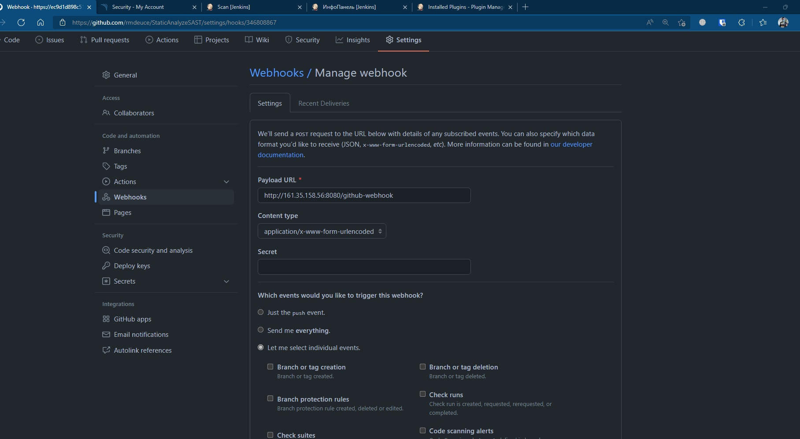

# Damn Vulnerable C# Application (API Only)

## Getting Started

### Docker

```
docker-compose up
```

### Manual

Install .NET Core 2.x SDK
[Microsoft .NET Core SDK](https://www.microsoft.com/net/download/macos)

Install dependencies and migrate database:

```
dotnet restore
dotnet ef database update
```

Start application server:

```
dotnet run
```

Start application server with watcher for auto-reload on change:

```
dotnet watch run
```

<p align="center">
  
  
  
  
  
  
  
  
  
  
  
  
  
  
  
  
  
  
  
  
  
  
  
  
  
  
  
  
  
  
  
  
  
  
  
  
  
  
  
  
  
  
  
  
  
  
  
  
  
  
  
  
  
  
  
</p>


